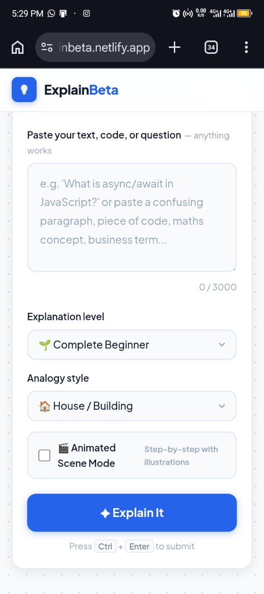

# ExplainBeta

> An interactive AI learning platform that helps beginners understand difficult concepts through simple explanations, practical analogies, and a proof-of-concept visual learning experience.

🌐 **Live Demo:** https://explainbeta.netlify.app/

**Status:** Working Prototype

---

## Why I Built ExplainBeta

The idea for ExplainBeta came from my own experience learning JavaScript.

While studying JavaScript, I sometimes understood the definition of a concept but still struggled to understand how it worked in practice.

I started using AI tools such as ChatGPT and Claude to get additional explanations. However, I often found myself prompting repeatedly to get explanations that were simple enough for a beginner and included practical examples and analogies.

That experience led me to experiment with an application built around a simple idea:

> **Explain difficult concepts like you're teaching a beginner.**

ExplainBeta came from that idea.

---

## The Core Idea

ExplainBeta combines AI-generated explanations with a simple visual learning experience.

Google Gemini is used to generate:

* Beginner-friendly explanations
* Practical examples
* Simple analogies
* Step-by-step explanations

For the current proof of concept, the application uses predefined SVG icons and animations to explore how visual elements could complement explanations.

The visuals are **not generated by AI**. They are currently implemented directly in the frontend as an early experiment toward a more advanced visual learning system.

The long-term goal is to explore how difficult technical concepts can be explained using a combination of:

* Clear language
* Practical examples
* Real-world analogies
* Interactive visuals

---

## Key Features

* AI-powered explanations
* Beginner-focused explanations
* Practical examples
* Analogy-based learning
* Step-by-step explanations
* Proof-of-concept visual learning
* SVG icons and animations
* Simple learning-focused interface
* Interactive concept explanations

---

## How It Works

At a high level, ExplainBeta follows this flow:

```text
User asks a question
        ↓
ExplainBeta frontend
        ↓
Cloudflare Worker
        ↓
Gemini API
        ↓
AI-generated explanation
        ↓
Frontend processes the response
        ↓
Explanation is presented to the user
        ↓
SVG proof-of-concept visuals complement the explanation
```

### Gemini API Integration

The Gemini API is used as the AI engine behind ExplainBeta.

When a user submits a concept or question:

1. The frontend sends the user's request to the application's API layer.
2. The request is handled by a **Cloudflare Worker**.
3. The Cloudflare Worker communicates with the **Google Gemini API**.
4. Gemini generates a beginner-friendly explanation.
5. The response is returned to the frontend.
6. ExplainBeta presents the explanation using its learning-focused interface.
7. Where applicable, predefined SVG visuals and animations complement the explanation.

The Gemini API key is **not exposed directly in the frontend**.

Instead, the API integration is handled through a Cloudflare Worker, providing a server-side layer between the frontend application and Gemini.

This approach helps keep the API credentials out of the client-side code.

---

## Technology Stack

### Frontend

* HTML
* CSS
* JavaScript
* SVG

### AI

* Google Gemini API

### API Layer

* Cloudflare Workers

### Deployment

* Netlify
* Cloudflare Workers

---

## Engineering Approach

ExplainBeta was intentionally built as a lightweight web application rather than starting with a large framework or complex architecture.

The project focuses on experimenting with a better way to learn difficult concepts.

The core approach is:

1. Understand the user's question.
2. Generate an accessible explanation using Gemini.
3. Present the explanation in a beginner-friendly structure.
4. Use practical examples and analogies to improve understanding.
5. Use SVG-based visuals as a proof of concept for visual learning.

The current SVG system is intentionally simple.

A more advanced visual and animation system is a possible future direction rather than part of the current implementation.

---

## AI-Assisted Development

AI tools were used throughout the development process for:

* Brainstorming
* Exploring implementation approaches
* Prompt development
* Generating implementation assistance
* Debugging
* Understanding unfamiliar code
* Iterating on the user experience

AI was used as a development accelerator while I remained responsible for:

* The product idea
* Feature decisions
* Testing
* Implementation direction
* User experience decisions
* Final integration

---

## Screenshots

### ExplainBeta Interface

Add project screenshot here.

For example:

```text

```

---

## Current Status

ExplainBeta is currently a **working prototype**.

The core experience is functional and available through the live demo.

The project is intentionally lightweight at this stage. The current implementation is focused on validating the concept of combining AI explanations with beginner-friendly presentation and simple visual elements.

---

## What I Learned

Building ExplainBeta reinforced an important lesson from my own learning experience:

> Having an explanation available does not always mean someone understands the concept.

The project pushed me to think about how software can make explanations more practical and easier to understand rather than simply returning more information.

It also gave me practical experience working with:

* Gemini API integration
* Cloudflare Workers
* Frontend JavaScript
* Prompt design
* SVG
* AI-assisted development
* API architecture
* Beginner-focused user experience design

---

## Future Direction

Future development may explore:

* More visual explanation types
* More sophisticated animations
* Additional learning modes
* Improved explanation structures
* Expanded concept coverage
* Interactive learning activities
* A more advanced visual and animation system

These are future directions and are **not currently represented as completed features**.

---

## Project Structure

The current prototype uses a lightweight frontend structure:

```text
explainbeta/
│
├── index.html
└── README.md
```

The API integration is handled separately through a Cloudflare Worker.

A simplified architecture looks like this:

```text
ExplainBeta Frontend
        │
        │ User Question
        ↓
Cloudflare Worker
        │
        │ API Request
        ↓
Google Gemini API
        │
        │ AI Response
        ↓
Cloudflare Worker
        │
        ↓
ExplainBeta Frontend
        │
        ├── Text Explanation
        ├── Examples
        ├── Analogies
        └── SVG Visuals
```

---

## Author

**Testimony Sani**

*AI-assisted Software Developer*

I enjoy identifying problems I experience personally and turning them into practical software solutions.
